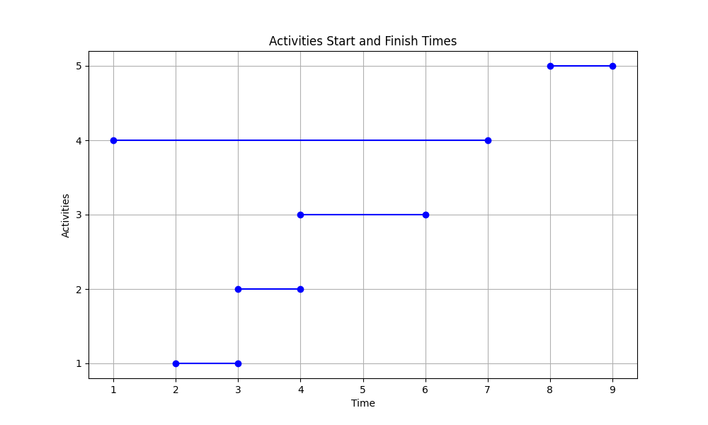
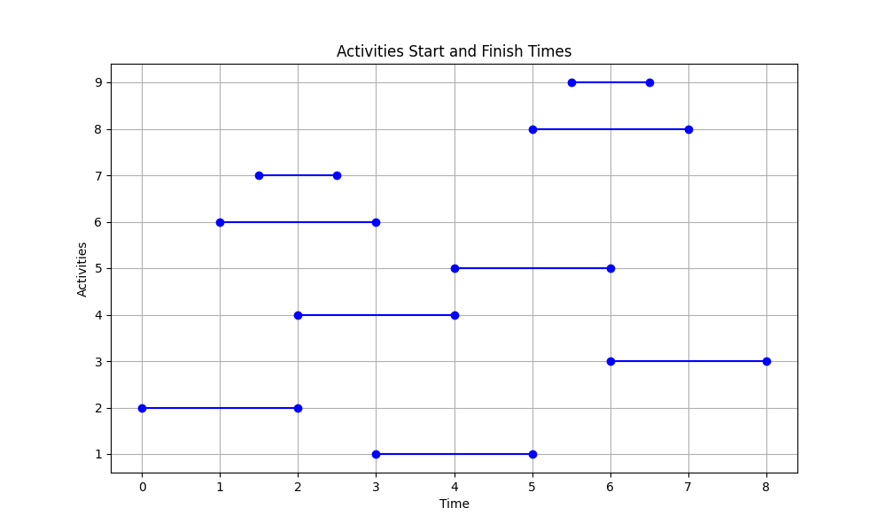

#### Discussion Section 012

<h1 style="text-align: center;">CSCI4041 Homework 5</h1>

<h4 style="text-align: center;">Hongzheng Li</h4>

## Problem 1:

Let's denote the start time of the activity $a_i$ as $s_i$, 
finish time of the activity $a_i$ as $f_i$.
Let $S_{ij}$ be the set of activities that start after $s_i$ and finish before $f_j$.
Consider any nonempty subproblem $S_{ij}$ , 
let $a_m$ be the activity in $S_{ij}$ with the latest start time.

<!-- First, let's prove that the subproblem $S_{mj}$ is empty, 
so that choosing $a_m$ leaves the subproblem $S_{im}$ as the only one that may be nonempty.

Suppose that $S_{mj}$ is not empty, 
then there exists some activity $a_k$
such that $s_m < f_m \leq s_k < f_k \leq f_j$.
Then $a_k$ is also in $S_{ij}$
and it has a later start time than $a_m$,
which contradicts our choice of $a_m$.
We conclude that $S_{mj}$ is empty. -->

The problem is equivalent to 
prove that activity $a_m$ is used 
in some maximum-size subset of mutually compatible activities of $S_{ij}$.

Suppose that $A_{ij}$ is a maximum-size subset of 
mutually compatible activities of $S_{ij}$,
and let us order the activities in $A_{ij}$ in monotonically increasing order of finish time.
Let $a_k$ be the the last activity in $A_{ij}$.

If $a_k = a_m$, then we are done.

If $a_k \neq a_m$, then we construct the subset 
$A'_{ij} = A_{ij}-\{a_k\}\cup \{a_m\}$.
The activities in $A'_{ij}$ are disjoint, 
since the activities in $A_{ij}$ are,
$a_k$ is the last activity in $A_{ij}$ to start,
and $f_m \geq f_k$.
Noting that $A'_{ij}$ has the same size as $A_{ij}$,
we see that $A'_{ij}$ is also a maximum-size subset of
mutually compatible activities of $S_{ij}$ that includes $a_m$.

Therefore, we have prove that there is always an optimal solution containing the activity that starts last, so that this is a valid greedy choice.

## Problem 2:

Consider the following set of activities 
(each represented by a pair of start and end times):

| Activity | Starts At | Ends At |
|----------|-----------|---------|
| 1        | 2         | 3       |
| 2        | 3         | 4       |
| 3        | 4         | 6       |
| 4        | 1         | 7       |
| 5        | 8         | 9       |



Now, let's apply the "choose the activity that starts first" strategy:

- First, we select Activity 4, as it starts first.
- Then, we select Activity 5, as it is the first activity that starts after activity 4 ends.
- Finally, no other activities can be selected because they all start before Activity 5 ends.

Thus, following the greedy strategy of choosing the activity that starts first, we end up selecting two activities (Activity 4 and Activity 5).

However, this is not an optimal solution. An optimal solution would be to select Activities 1, 2, 3 and 5, which are four activities in total.

Therefore, we can conclude that choosing the activity that starts first is **NOT** a valid greedy choice.

---

## Problem 3:

Consider the following set of activities:

| Activity  |Starting Time | Finishing Time | # of overlaps |
|-----------|--------------|----------------|---------------|
| A         | 3            | 5              | 2             |
| B         | 0            | 2              | 2             |
| C         | 6            | 8              | 2             |
| D         | 2            | 4              | 3             |
| E         | 4            | 6              | 3             |
| F         | 1            | 3              | 3             |
| G         | 1.5          | 2.5            | 3             |
| H         | 5            | 7              | 3             |
| I         | 5.5          | 6.5            | 3             |

Graph for the above activities:



Now, let's apply the "choose the activity that overlaps the fewest other activities" strategy:

- First, we select Activity 2, as it starts first with fewest overlaps.
- Then, we select Activity 1, as it overlaps the fewest and start after Activity 2 ends.
- Then, we select Activity 3, as it overlaps the fewest and start after Activity 1 ends.
- Finally, no other activities can be selected because they all start before Activity 3 ends.

Thus, following the greedy strategy of choosing the activity that overlaps the fewest, we end up selecting three activities (Activity 2, Activity 1 and Activity 3).

However, this is not an optimal solution. An optimal solution would be to select Activities 2, 4, 5 and 3, which are four activities in total.

Therefore, we can conclude that choosing the activity that overlaps the fewest other activities is **NOT** a valid greedy choice.

---

## Problem 4:

Without loss of generality, let's assume that $z_i - z_{i-1} \leq r$ for all $i\in n$. Otherwise, the robot cannot reach the top knot, 
and the problem is unsolvable.

We can solve the problem using the below method:

1. Start at the lowest knot (origin).
2. From the current knot, find the highest knot that the robot can reach (i.e., within $r$ millimeters).
3. Move to the highest reachable knot found in step 2.
4. Repeat steps 2 and 3 until the robot reaches the top knot.

```pseudocode
FindSmallestStep(knots, r)
    selected_knots = []
    last_index = 0
    for current_index = 0 upto knots.size
        if knots[current_index] - knots[last_index] > r
            selected_knots.append(knots[current_index-1])
            last_index = current_index-1
    if last_index != knots.size
        selected_knots.append(knots.size)
    return selected_knots
```

**Prove of correctness:**

At each step, the robot has a reach of $r$ millimeters and can move to any knot within this range. 
The greedy choice is to move to the farthest knot within this reach. 
This choice is safe because:

- If the robot were to choose a closer knot instead, it would only make progress less than or equal to $r$ millimeters, but by choosing the farthest knot, it maximizes the progress towards the top knot.

- Choosing a closer knot could potentially increase the total number of steps needed to reach the top, as it could lead to additional intermediate steps.

In this problem, the subproblems are the steps from the current knot to the next one. 
If the first move is to the farthest knot within reach, 
then the problem now becomes finding the optimal path from this new knot to the top. 
The same logic applies—moving to the farthest knot within reach from this new position is the best local move.

Hence, each step is locally optimal, and since each step does not affect the subsequent choices (each choice is independent of the previous one), the local optimum at each stage leads to a global optimum.

Since each move to the farthest knot within reach maximizes the progress toward the goal, 
and since the problem does not have interdependencies that could cause a locally optimal move to lead to a suboptimal overall solution, 
the greedy algorithm must lead to an overall optimal solution.

**Running time analysis:**

The core of the algorithm is the for loop, 
which traverses the $n$ knots array once,
and takes $O(n)$ time.
Therefore, the running time of the algorithm is $O(n)$.

## Problem 5:

```python
MaxScore(A[], B[])
    A.mergesort()
    B.mergesort()
    score = 0
    for i = 1 upto A.size
        score += A[i] * B[i]
    return score
```

**Prove of correctness:**

Without loss of generality, let's assume that $A$ contains 2 elements, $a_1$ and $a_2$, and $B$ contains 2 elements, $b_1$ and $b_2$. 
Suppose that $a_1 < a_2$ and $b_1 < b_2$.
Now, we want to prove that the optimal solution is to pair $a_1$ with $b_1$ and $a_2$ with $b_2$.

Since $b_2>b_1$, we can have $b_2-b_1>0$
$$\begin{aligned}
a_2 > a_1
&\Rightarrow a_2(b_2-b_1) > a_1(b_2-b_1)\\
&\Rightarrow a_2b_2-a_2b_1 > a_1b_2-a_1b_1\\
&\Rightarrow a_1b_1+a_2b_2 > a_1b_2+a_2b_1
\end{aligned}$$

Then, we have prove that if $a_1 < a_2$ and $b_1 < b_2$, then $a_1b_1+a_2b_2 > a_1b_2+a_2b_1$.

Then, for $A$, $B$ with arbitrary size,
let's sort $A$, $B$ in accending order.

To solve this problem, at each step $i$, 
we will find a greedy choice to pair with $A[i]$. 

The problem has the optimal substructure characteristic, 
meaning that after making the greedy choice for $A[i]$,
the remaining subproblem (finding the maximum score for the rest of the elements) 
is independent of this choice and resembles the original problem.

Let's say we will pair $A[i]$ 
with $B[j]$, 
where $j$ is an arbitrary number, where $i < j \leq A.size$
(since we have already make a good pair for the preceeding ones).

Using above proof, however we choose $j$, 
since A, B is sorted in ascending order,
and $i < j$, we will have
$A[i]B[i] + A[j]B[j] > A[i]B[j] + A[j]B[i]$.
That is, if we choose to pair $A[i]$ 
with $B[j]$,
we can always find a better score by pairing $A[i]$ 
with $B[i]$.
Therefore,
we can conclude that the greedy choice is to pair $A[i]$ 
with $B[i]$, for $i\in [1, A.size]$.
Therefore, the bijection $f: A \rightarrow B$ to 
get maximum possible score is first sort $A$, $B$ in ascending order, 
then pair $A[i]$ 
with $B[i]$, 
that is, $f(A[i]) = B[i]$,
for $i\in [1, A.size]$.
And that is what we do in the algorithm.

**Running time analysis:**

Since sorting $A$ and $B$ both takes $O(n\log n)$ time, 
and the for loop takes $O(n)$ time. 
As $n$ grows larger, $O(n\log n)$ dominates $O(n)$,
so the runtime of the algorithm is $O(n\log n)$.

---

## Problem 6:

We can solve the problem using the below method:

1. Sort the numbers in set $S$ in ascending order.
2. Start from the first number that is not 
covered by some interval in $U$, let's call it $a$.
Then, we add an interval $[a, a+1]$ 
to $U$.
3. Repeat step 2 until all numbers in $S$ are covered.

Prove of correctness:

At step 2, choosing the interval $[a, a+1]$ 
where $a$ is the smallest number that is not covered by some interval in $U$ 
ensures that we are using the least number of intervals possible up to that point. 
Suppose that we also have an number $a+1$ in S. 
If we do not choose the interval $[a, a+1]$, 
we end up using two intervals to cover $a$ and $a+1$.
Therefore, this choice is greedy.

The optimal substructure comes from the fact that once an interval is placed starting at a number $a$, 
the subproblem becomes covering the remaining numbers in $S$ that are not yet covered.

Thus, given that each greedy step is locally optimal and the problem can be broken down into optimal substructures, the greedy algorithm constructs a globally optimal solution for covering the set $S$ with the minimum number of unit intervals.